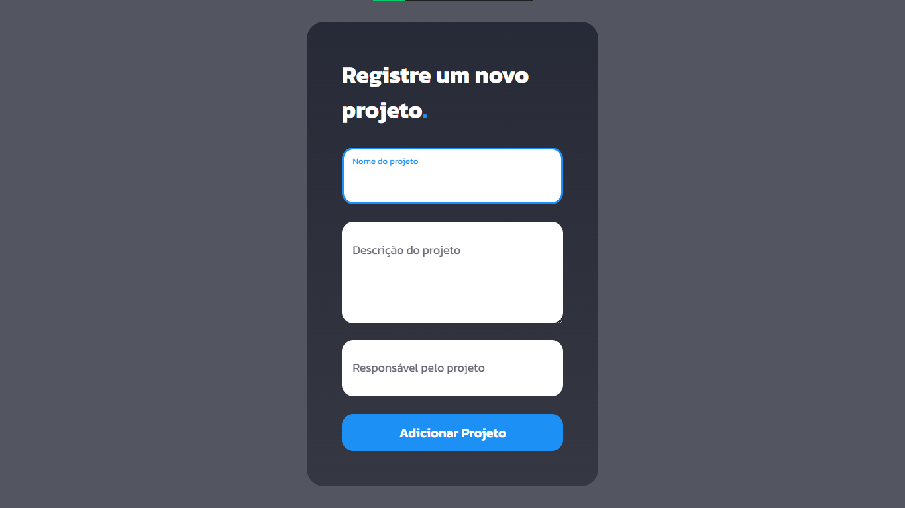

# Project Manager

## - Introdução -

Projeto que retrata um Simulador de Gerenciador de Projetos, permitindo adicionar projetos (fornecendo o nome do mesmo, a descrição e o responsável) e visualizar os projetos cadastrados no sistema <i>(funcionalidade a ser adicionada)</i>.

---

## Tecnologias e Conceitos utilizados

Foram utilizadas as seguintes tecnologias neste projeto:

- NodeJS;
- MySQL;
- HTML5;
- CSS3 (Sass/Scss);
- JavaScript;
- Rotas;
- Desestruturação;
